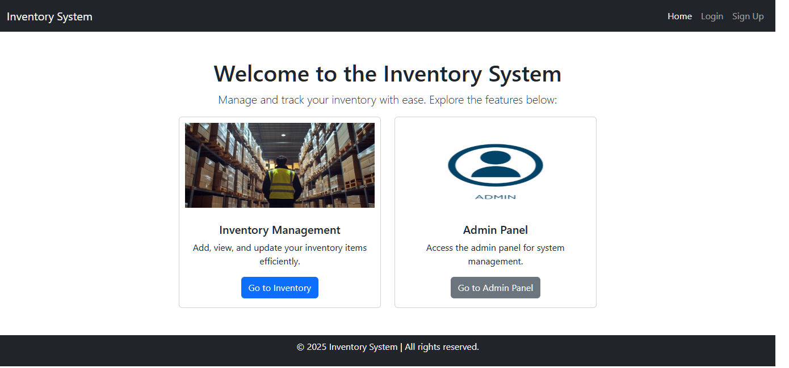
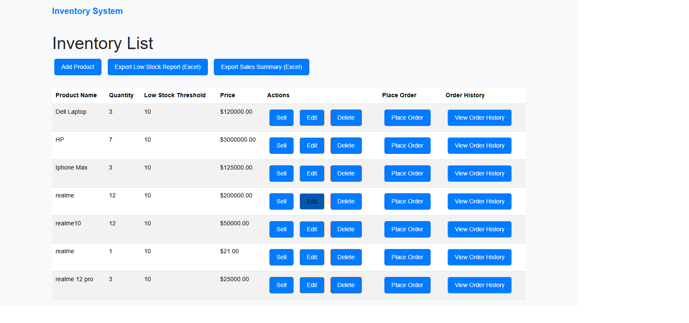
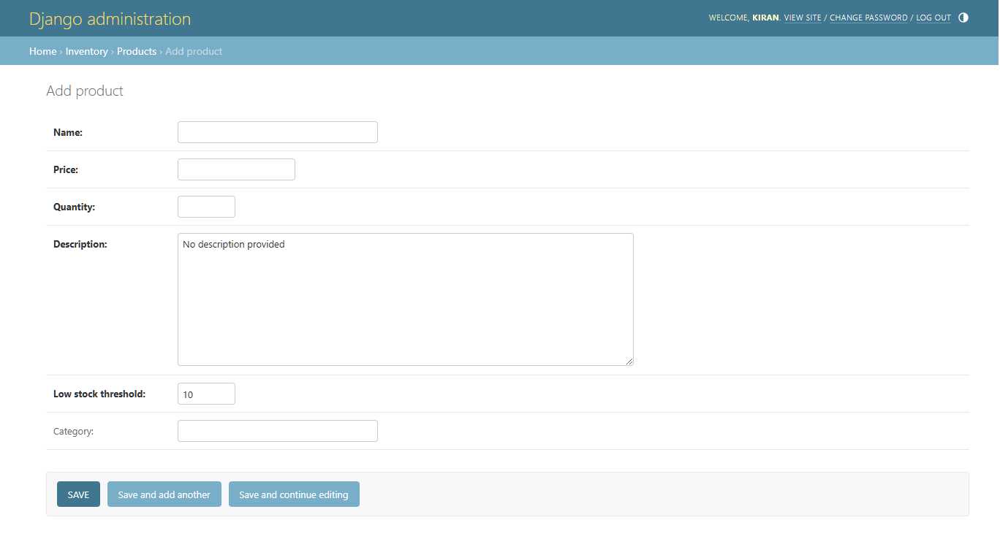
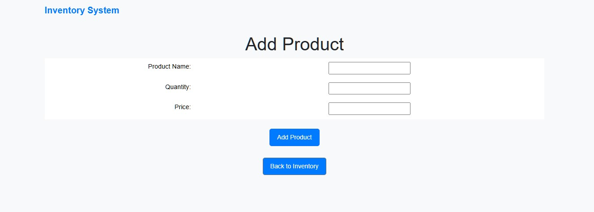
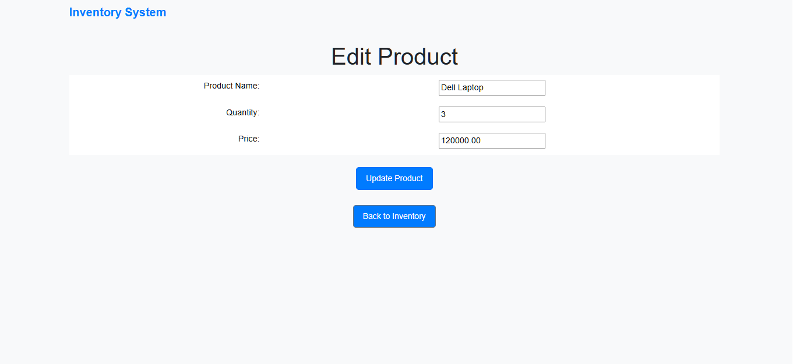
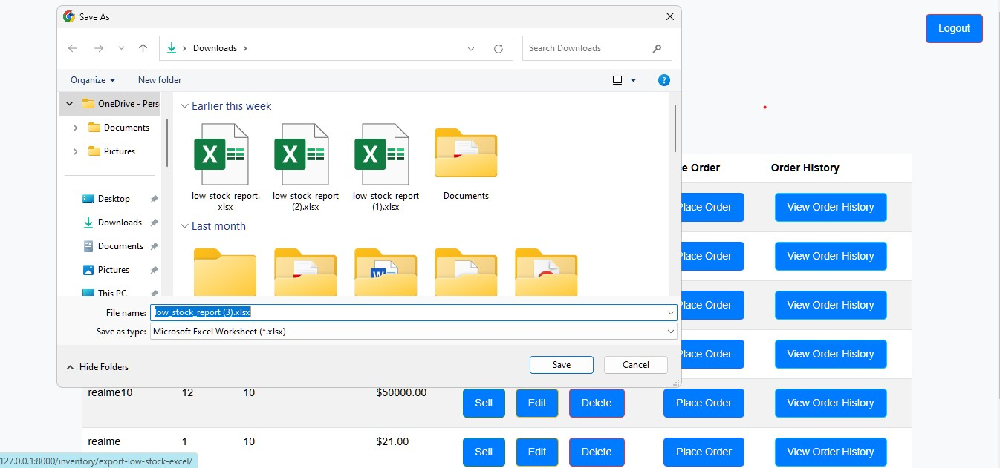
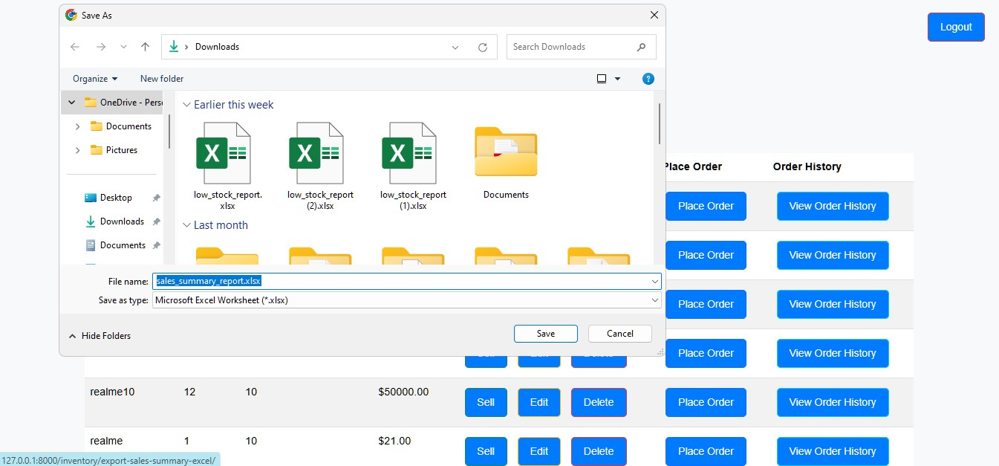

# Inventory-Management-System


## Introduction

The **Inventory Management System** is a web application designed to help businesses track their inventory, manage products, and streamline the ordering process. The system allows users to add, update, view, and delete products from the inventory. It also provides real-time updates on stock levels, pricing, and product details.

This project utilizes a full-stack approach with **Python** (Django) for the backend, **MySQL** for the database, and **HTML, CSS, JavaScript** for the frontend. The system ensures that inventory data is accurate and helps users maintain an optimized stock level to meet business demands.


## Table of Contents

- [Features](#features)
- [Tech Stack](#tech-stack)
- [Installation](#installation)
- [Usage](#usage)
- [Screenshots](#screenshots)
- [API Endpoints](#api-endpoints)
- [Contributing](#contributing)
- [License](#license)

## Features

- **Product Management**: Add, edit, and delete products.
- **Inventory Tracking**: Monitor stock levels in real time.
- **Sales Management**: Process sales transactions and update stock.
- **Order Management**: Create and manage purchase orders.
- **Low-Stock Alerts**: Get notifications when stock is below threshold.
- **Reporting**: Generate sales and inventory reports in CSV/Excel formats.
- **User Authentication**: Secure login and access control.
- **Admin Dashboard**: A user-friendly admin panel to manage data.

## Tech Stack

- **Backend**: Django, Python
- **Database**: MySQL
- **Frontend**: HTML, CSS, JavaScript
- **Reporting**: OpenPyXL for Excel export
- **Version Control**: Git, GitHub

## Installation

1. **Clone the Repository**

   ```bash
   git clone https://github.com/yourusername/inventory-management.git
   cd inventory-management
   ```

2. **Create a Virtual Environment**

   ```bash
   python3 -m venv venv
   source venv/bin/activate  # On Windows: venv\Scripts\activate
   ```

3. **Install Dependencies**

   ```bash
   pip install -r requirements.txt
   ```

4. **Configure Database**

   - Update `settings.py` with MySQL database credentials:
     ```python
     DATABASES = {
         'default': {
             'ENGINE': 'django.db.backends.mysql',
             'NAME': 'inventory_db',
             'USER': 'root',
             'PASSWORD': 'yourpassword',
             'HOST': 'localhost',
             'PORT': '3306',
         }
     }
     ```

5. **Apply Migrations**

   ```bash
   python manage.py makemigrations
   python manage.py migrate
   ```

6. **Create Superuser**

   ```bash
   python manage.py createsuperuser
   ```

7. **Run Development Server**

   ```bash
   python manage.py runserver
   ```

   Open `http://127.0.0.1:8000/` to access the application.

## Usage

- **Admin Panel**: `http://127.0.0.1:8000/admin/` (Login with superuser credentials)
- **Dashboard**: View inventory status and recent sales
- **Add Product**: Create new products
- **Manage Orders**: Process and track orders
- **Reports**: Export sales and inventory reports


## Screenshots

Below are some screenshots of the Inventory Management System in action:

Dashboard



Product List



Add Product Form




Edit Product



Reports




## API Endpoints

| Endpoint              | Method | Description               |
| --------------------- | ------ | ------------------------- |
| `/api/products/`      | GET    | Retrieve all products     |
| `/api/products/{id}/` | GET    | Retrieve a single product |
| `/api/orders/`        | POST   | Create a new order        |
| `/api/reports/sales/` | GET    | Get sales report          |

## Contributing
Feel free to fork the repository and contribute. To contribute:
1. **Fork the Repository**
2. **Create a Branch** (`feature/new-feature`)
3. **Commit Changes** (`git commit -am 'Add new feature`)
4. **Push and Open a Pull Request** 

## License

This project is licensed under the MIT License - see the LICENSE file for details.

### Adding Screenshots:

1. Create a `screenshots` directory inside your project folder.
2. Save your screenshots (e.g., `dashboard.png`, `product_list.png`) in the `screenshots` folder.
3. The Markdown code above uses the relative path to reference these images.

To capture the screenshots for your project, you can take screenshots of key sections of your app (like the dashboard, product list, add/edit product forms, etc.) using your preferred screenshot tool. 


